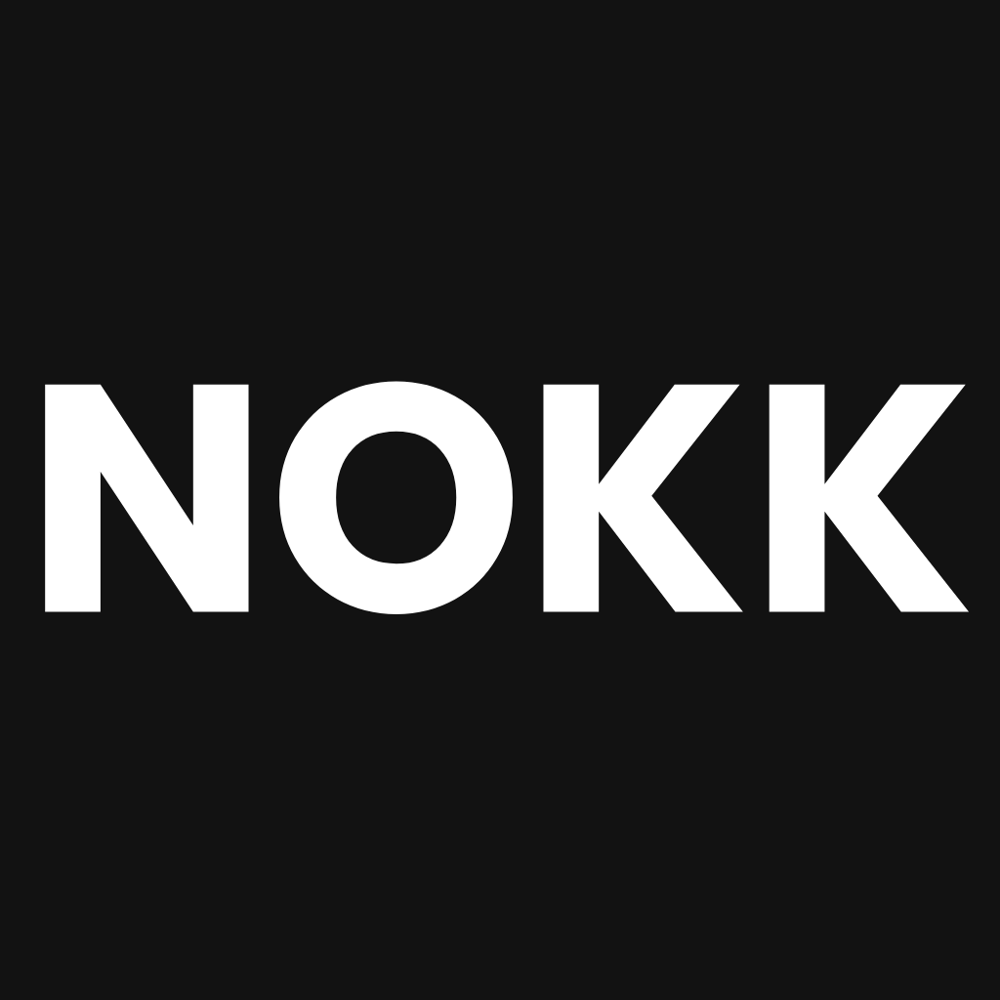

# NOKK - Personal Safety Voice App

<p align="center">
  
</p>

<p align="center">
  <strong>Your Safety Voice - Instant Protection at Home</strong>
</p>

<p align="center">
  <a href="#features">Features</a> •
  <a href="#installation">Installation</a> •
  <a href="#development">Development</a> •
  <a href="#deployment">Deployment</a>
</p>

---

## About

NOKK is a personal safety voice app designed to protect people when someone suspicious comes to their door. With one tap, the app instantly plays a strong adult male voice, making outsiders believe there's a grown man inside.

**Target Users:**
- Women living alone
- Children staying home alone
- Anyone seeking extra home security

## Features

### Core Features
- ⚡ **One-Tap Instant Playback** - No delays, no confirmations
- 🎙️ **Real Human Male Voices** - Natural, confident, not robotic
- 🌍 **Multi-Language Support** - English, Korean, Japanese, Spanish
- 📴 **Offline Support** - All audio stored locally
- 🎨 **Modern UI** - Spotify-inspired design with dark mode

### Quick Actions (Free)
- "Who is it?"
- "Leave it at the door."
- "I'm calling the police."

### Categories
- Delivery situations
- Unknown visitors
- Threat responses
- Night situations
- General responses

### Premium Features
- All phrases unlocked
- Voice tone options (Normal, Firm, Angry)
- 5 customizable quick action slots
- Ad-free experience

## Tech Stack

- **Framework:** React Native 0.73 + Expo SDK 50
- **Language:** TypeScript
- **State Management:** Zustand
- **Navigation:** React Navigation 6
- **Audio:** expo-av
- **IAP:** expo-in-app-purchases
- **Ads:** expo-ads-admob
- **Auth:** expo-auth-session
- **i18n:** i18next + react-i18next

## Installation (Windows 사용자도 가능!)

### Prerequisites
- Node.js 18+
- npm or yarn
- **Mac 불필요!** Expo를 사용하면 Windows에서도 iOS 테스트 가능

### 빠른 시작

```bash
# 프로젝트 폴더로 이동
cd Desktop/Nokk

# 의존성 설치
npm install

# Expo CLI 설치 (처음 한 번만)
npm install -g expo-cli eas-cli

# 개발 서버 시작
npm start
```

### iPhone에서 테스트하기 (Mac 없이!)

1. **iPhone에 Expo Go 설치**
   - App Store에서 "Expo Go" 다운로드

2. **앱 실행**
   - 터미널에 나타난 QR 코드를 iPhone 카메라로 스캔
   - Expo Go에서 자동으로 앱 실행!

3. **실시간 업데이트**
   - 코드를 수정하면 앱이 자동으로 리로드됩니다

### Android에서 테스트하기

1. Play Store에서 "Expo Go" 설치
2. QR 코드 스캔하여 앱 실행

### 실제 빌드 (EAS Build)

```bash
# Expo 계정 로그인
eas login

# iOS 빌드 (클라우드에서 자동 빌드 - Mac 불필요!)
eas build --platform ios --profile preview

# Android 빌드
eas build --platform android --profile preview
```

**자세한 설명은 `EXPO_SETUP.md`를 참고하세요!**

## Project Structure

```
nokk/
├── src/
│   ├── assets/          # Audio files, images
│   ├── components/      # Reusable UI components
│   ├── constants/       # Theme, data constants
│   ├── hooks/           # Custom React hooks
│   ├── i18n/            # Internationalization
│   │   └── locales/     # Language files (en, ko, ja, es)
│   ├── navigation/      # React Navigation setup
│   ├── screens/         # App screens
│   ├── services/        # Audio, IAP, Auth services
│   ├── store/           # Zustand state management
│   └── types/           # TypeScript definitions
├── android/             # Android native code
├── ios/                 # iOS native code
├── store/               # App Store assets
│   ├── app-store/       # iOS App Store materials
│   └── google-play/     # Google Play materials
└── docs/                # Documentation
```

## Development

### Adding New Phrases

1. Add phrase to `src/constants/data.ts`
2. Add translations to all locale files in `src/i18n/locales/`
3. Record audio files for all language/tone combinations
4. Place audio in `src/assets/audio/`

### Audio File Naming Convention
```
{phrase_id}_{language}_{tone}.mp3

Examples:
- unknown_who_en_normal.mp3
- delivery_leave_door_ko_firm.mp3
- threat_calling_police_ja_angry.mp3
```

### Testing

```bash
# Run tests
npm test

# Type checking
npm run typecheck

# Lint
npm run lint
```

## Deployment

### EAS Build (권장)

```bash
# 프로덕션 빌드
eas build --platform ios --profile production
eas build --platform android --profile production

# 스토어 제출
eas submit --platform ios
eas submit --platform android
```

자세한 내용은 다음 문서를 참고하세요:
- [EXPO_SETUP.md](./EXPO_SETUP.md) - Expo 설치 및 개발 가이드
- [SUBMISSION_GUIDE.md](./SUBMISSION_GUIDE.md) - 스토어 제출 가이드

## Configuration

### Environment Variables

Create `.env` file:
```env
ADMOB_APP_ID_IOS=ca-app-pub-xxx
ADMOB_APP_ID_ANDROID=ca-app-pub-xxx
ADMOB_BANNER_ID_IOS=ca-app-pub-xxx
ADMOB_BANNER_ID_ANDROID=ca-app-pub-xxx
GOOGLE_WEB_CLIENT_ID=xxx.apps.googleusercontent.com
```

### In-App Purchase Product IDs
- `nokk_premium_monthly` - $2.99/month
- `nokk_premium_yearly` - $19.99/year
- `nokk_premium_lifetime` - $49.99 one-time

## Privacy

NOKK is designed with privacy first:
- No account required
- No data collection
- No tracking
- Works fully offline
- Optional Google Sign-In (not required)

## License

Copyright © 2024 NOKK App. All rights reserved.

## Support

- Website: https://nokk.app
- Email: support@nokk.app
- Privacy Policy: https://nokk.app/privacy
- Terms of Service: https://nokk.app/terms
